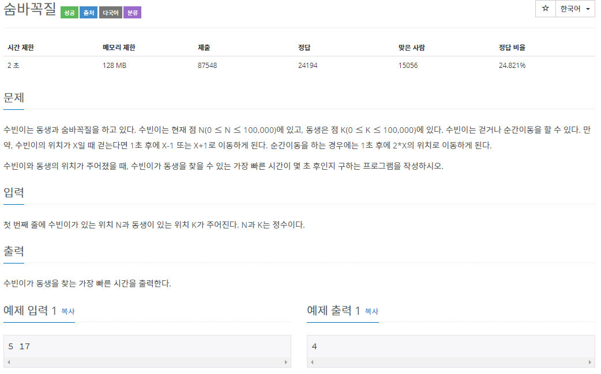
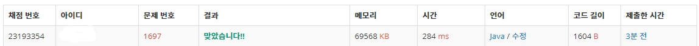

# 1697 숨박꼭질(java)
---------------------------------------------

## 전체 코드
~~~java
import java.util.LinkedList;
import java.util.Queue;
import java.util.Scanner;

public class num1697 {
	static int n, k;
    static int[] time = new int[100001];
    static boolean[] visited = new boolean[100001];

    public static void main(String args[]) {

	      Scanner scan = new Scanner(System.in);

	      n = scan.nextInt();
	      k = scan.nextInt();	     

	      bfs();	     

	      System.out.println(time[k]);

    }

    private static void bfs(){

        Queue<Integer> q = new LinkedList<>();
        q.add(n);       

        int next;
        while(!q.isEmpty()){

            next = q.poll();

            visited[next] = true;           

            if(next == k) break;           

            if(next != 0){ 
                if(!visited[next-1]){
                    q.add(next-1);

                    if(time[next-1] == 0 || (time[next-1] != 0 && time[next-1] > time[next]+1))
                        time[next-1] = time[next]+1;
                }
            }
            
            if(next != 100000){
                if(!visited[next+1]){
                    q.add(next+1);

                    if(time[next+1] == 0 || (time[next+1] != 0 && time[next+1] > time[next]+1))
                        time[next+1] = time[next]+1;
                }

            }           

            if(next*2 < 100001){
                if(!visited[next*2]){
                    q.add(next*2);

                    if(time[next*2] == 0 || (time[next*2] != 0 && time[next*2] > time[next]+1))
                        time[next*2] = time[next]+1;
                }

            }

       }
	}

}
~~~

