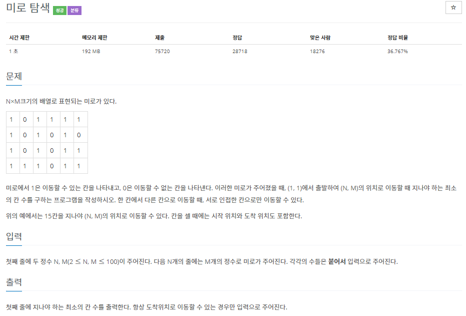
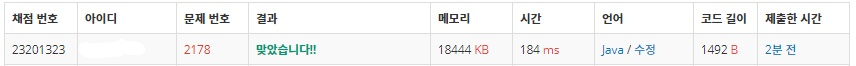

# 2178 미로찾기(java)
---------------------------------------------

## 전체 코드 
~~~java
import java.util.LinkedList;
import java.util.Queue;
import java.util.Scanner;

public class num2178 {
	static int n, m;
	static int[][] map;
	static int[][] visited;
	public static void main(String[] args){
    	Scanner scan = new Scanner(System.in);
    	n = scan.nextInt();
    	m = scan.nextInt();
    	
    	map = new int[n][m];
    	visited = new int[n][m];
    	for(int i=0; i<n; i++) {
    		String input = scan.next();
    		for(int j=0; j<m; j++) {
    			map[i][j] = Integer.parseInt(input.charAt(j)+"");
    		}   
    		scan.nextLine();
    	}
    	
    	bfs();
    	
    	System.out.println(visited[n-1][m-1]);
    	
	}
	private static void bfs() {
		Queue<Integer> q = new LinkedList<>();
		q.add(0);
		visited[0][0] = 1;
		int qData, x, y;
		while(!q.isEmpty()) {
			qData = q.poll();
			x = qData/1000;
			y = qData%1000;
			
			if(x == n && y == m) break;
			
			if(x>0) { // 상
				if(map[x-1][y] == 1 && visited[x-1][y] == 0) {
					q.add((x-1)*1000 + y);
					visited[x-1][y] = visited[x][y]+1;
				}
			}
			
			if(x<n-1) { // 하
				if(map[x+1][y] == 1 && visited[x+1][y] == 0) {
					q.add((x+1)*1000 + y);
					visited[x+1][y] = visited[x][y]+1;
				}
			}

			if(y>0) { // 좌
				if(map[x][y-1] == 1 && visited[x][y-1] == 0) {
					q.add(x*1000 + y-1);
					visited[x][y-1] = visited[x][y]+1;
				}
			}
			
			if(y<m-1) { // 우
				if(map[x][y+1] == 1 && visited[x][y+1] == 0) {
					q.add(x*1000 + y+1);
					visited[x][y+1] = visited[x][y]+1;
				}
			}
		}
	}
}
~~~

