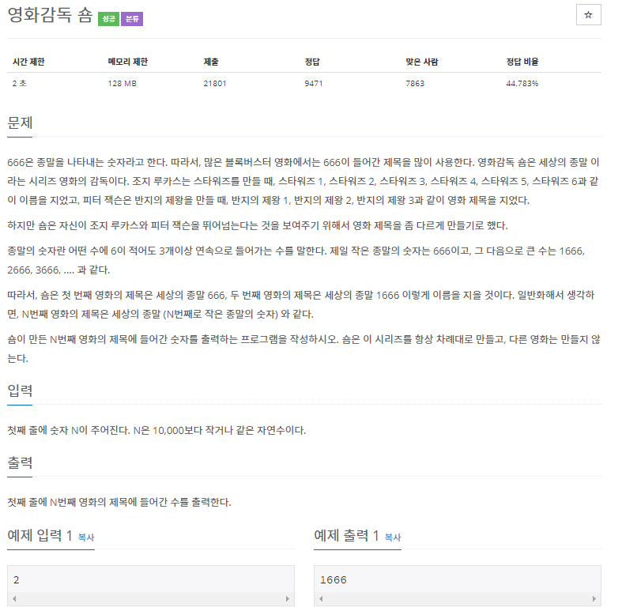
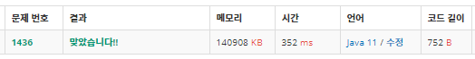

# 1436 영화감독 숌
-----------------

~~~java
package com.example.demo;

import java.io.BufferedReader;
import java.io.BufferedWriter;
import java.io.IOException;
import java.io.InputStreamReader;
import java.io.OutputStreamWriter;

public class num2 {
	static boolean[][] board;
	static int n, m;
	static int min = Integer.MAX_VALUE;
	public static void main(String[] args) throws IOException {
		BufferedReader bf = new BufferedReader(new InputStreamReader(System.in));
		BufferedWriter bw = new BufferedWriter(new OutputStreamWriter(System.out));
		
		int n = Integer.parseInt(bf.readLine());
		
		int count= 0;
		int num = 666;
		String number="";
		while (count<n) {
			number = String.valueOf(num);
			if(number.contains("666")) {
				count++;
			}
			num++;
		}
		bw.write(number);
		bw.flush();
		bw.close();		
	}	
}

~~~

