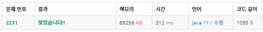

# 2231 블랙잭 (java)
------------------------------

~~~ java
import java.io.BufferedReader;
import java.io.BufferedWriter;
import java.io.IOException;
import java.io.InputStreamReader;
import java.io.OutputStreamWriter;
import java.util.ArrayList;
import java.util.List;

public class Main {
		static int min = Integer.MAX_VALUE;
		static int n;
	public static void main(String[] args) throws IOException {
		BufferedReader bf = new BufferedReader(new InputStreamReader(System.in));
		BufferedWriter bw = new BufferedWriter(new OutputStreamWriter(System.out));
		
		n = Integer.parseInt(bf.readLine());
		
		boolean check = false;
		for(int i=0; i<n; i++) {

			if(findCreater(i)) break;
		}
			
		min = min>n ? 0 : min;
		bw.write(min+"");
		
		bw.flush();
		bw.close();
		
	}
	private static boolean findCreater(int num) {
		
		List<Integer> list = new ArrayList<>();
		list.add(num);
		
		int number = num;
		while(number>10) {
			list.add(number%10);
			number /= 10;
		}
		list.add(number);
		
		int sum = 0;
		for(int i=0; i<list.size(); i++) {
			sum += list.get(i);
		}
		if(sum == n) {
			min = num;
			return true;
		}
		
		return false;
		
	}
}

~~~

###### tags: `Algorithm`