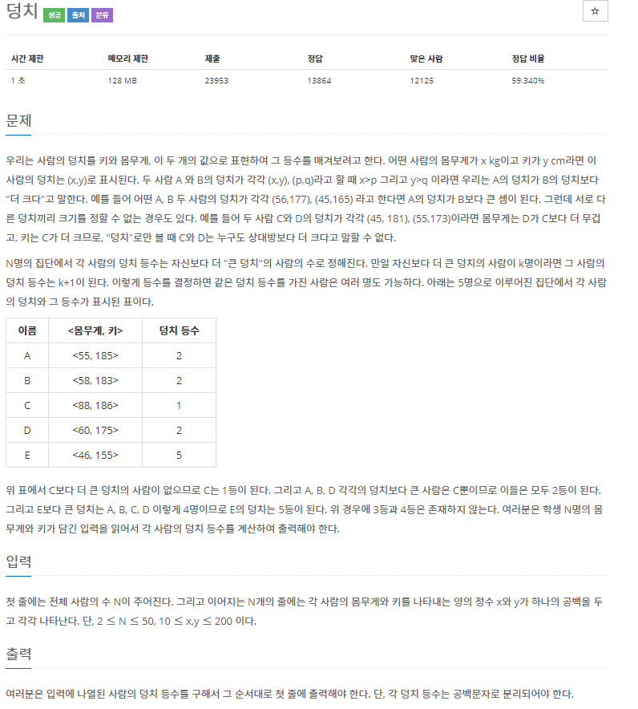
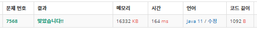

# 7568 덩치 (java)
-------------------------

~~~ java
package com.example.demo;

import java.io.BufferedReader;
import java.io.BufferedWriter;
import java.io.IOException;
import java.io.InputStreamReader;
import java.io.OutputStreamWriter;

public class num2 {
	static int[][] list;
	static int n;
	public static void main(String[] args) throws IOException {
		BufferedReader bf = new BufferedReader(new InputStreamReader(System.in));
		BufferedWriter bw = new BufferedWriter(new OutputStreamWriter(System.out));
		
		n = Integer.parseInt(bf.readLine());
		list = new int[n][2];

		String[] inputs = new String[2];
		for(int i=0; i<n; i++) {
			String input = bf.readLine();
			inputs = input.split(" ");
			list[i][0] = Integer.parseInt(inputs[0]);
			list[i][1] = Integer.parseInt(inputs[1]);
		}
		
		
		
		for(int i=0; i<n; i++) {
			bw.write(countRank(i)+" ");
		}
		
		bw.flush();
		bw.close();
		
	}
	private static int countRank(int index) {
		int rank = 0;
		
		int w = list[index][0];
		int h = list[index][1];
		
		for(int i=0; i<n; i++) {
			
			if(i == index) continue;
			
			if(w < list[i][0] && h < list[i][1]) rank++;
			
		}
		
		return rank+1;
		
	}
	
}

~~~

###### tags: `Algorithm`