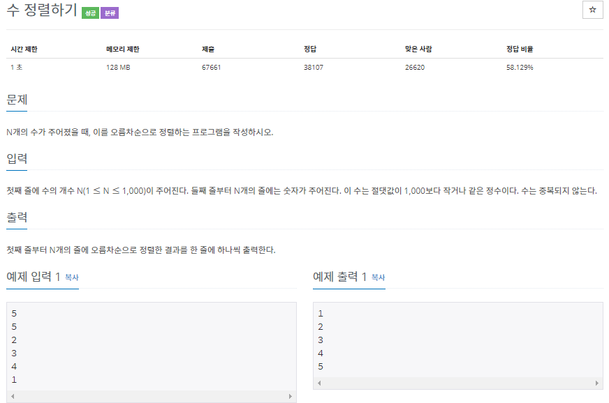
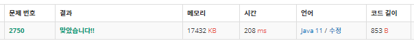

# 2750. 수 정렬하기 (java)
----------------------------------

~~~ java
import java.io.BufferedReader;
import java.io.BufferedWriter;
import java.io.IOException;
import java.io.InputStreamReader;
import java.io.OutputStreamWriter;

public class Main {
	public static void main(String[] args) throws IOException {
		BufferedReader bf = new BufferedReader(new InputStreamReader(System.in));
		BufferedWriter bw = new BufferedWriter(new OutputStreamWriter(System.out));
		
		int n = Integer.parseInt(bf.readLine());
		int[] list = new int[n];
		for(int i=0; i<n; i++) {
			list[i] = Integer.parseInt(bf.readLine());
		}
		
		int min = Integer.MAX_VALUE;
		int temp;
		for(int i=0; i<n; i++) {
			for(int j=0; j<n; j++) {
				if(list[i]<list[j]) {
					temp = list[i];
					list[i] = list[j];
					list[j] = temp;
				}
			}
		}
		
		for(int i=0; i<n; i++) {
			bw.write(list[i]+"\n");
		}
		
		bw.flush();
		bw.close();		
	}	
}
~~~

###### tag : 'Algorithum'