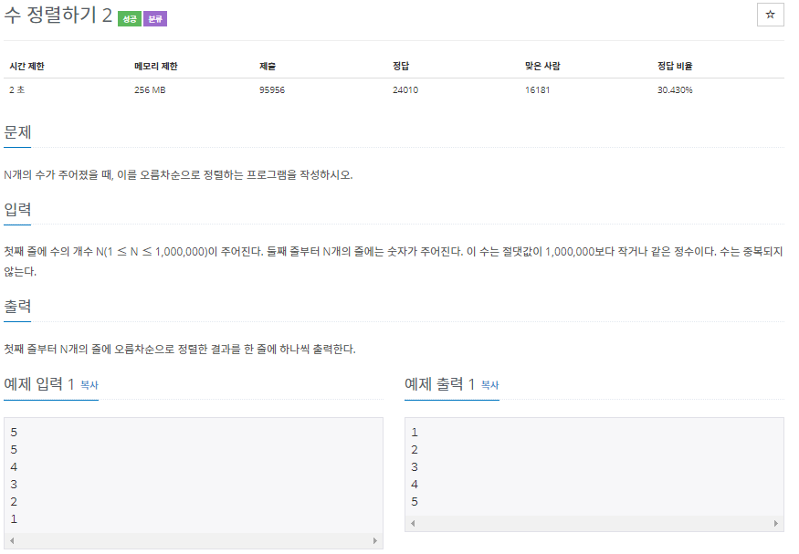
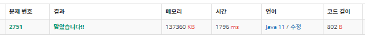

# 2751. 수 정렬하기 2 (java)

------------------------------

~~~java
import java.io.BufferedReader;
import java.io.BufferedWriter;
import java.io.IOException;
import java.io.InputStreamReader;
import java.io.OutputStreamWriter;
import java.util.ArrayList;
import java.util.Collection;
import java.util.Comparator;
import java.util.List;

public class Main {
	public static void main(String[] args) throws IOException {
		BufferedReader bf = new BufferedReader(new InputStreamReader(System.in));
		BufferedWriter bw = new BufferedWriter(new OutputStreamWriter(System.out));
		
		int n = Integer.parseInt(bf.readLine());
		List<Integer> list = new ArrayList<>();
		for(int i=0; i<n; i++) {
			list.add(Integer.parseInt(bf.readLine()));
		}
		list.sort(Comparator.naturalOrder());
		
		for(int num : list) {
			bw.write(num+"\n");
		}
		
		bw.flush();
		bw.close();		
	}	
}
~~~

