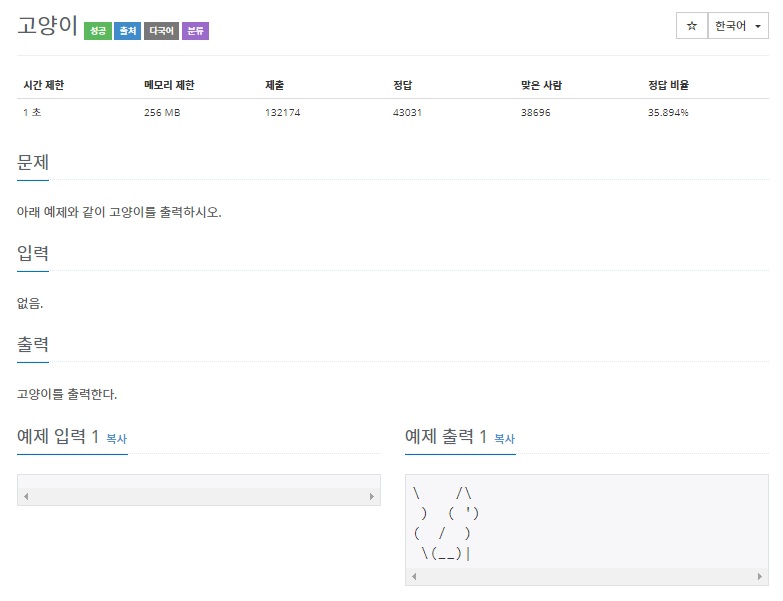
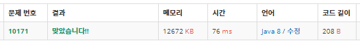

# 10171 고양이(java)
------------------------

~~~java
public class Main {
	public static void main(String[] args) {
		
		System.out.println("\\    /\\");
		System.out.println(" )  ( ')");
		System.out.println("(  /  )");
		System.out.println(" \\(__)|");
		
	}
}
~~~

